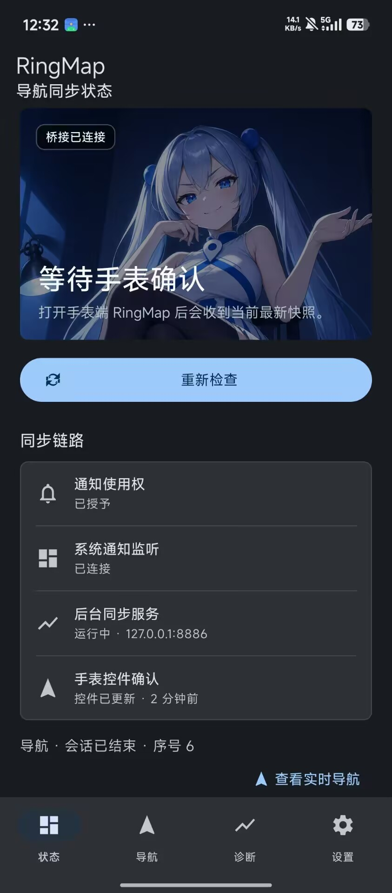
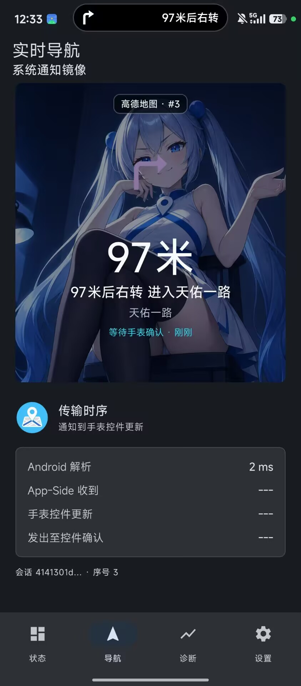
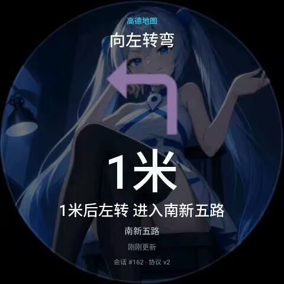
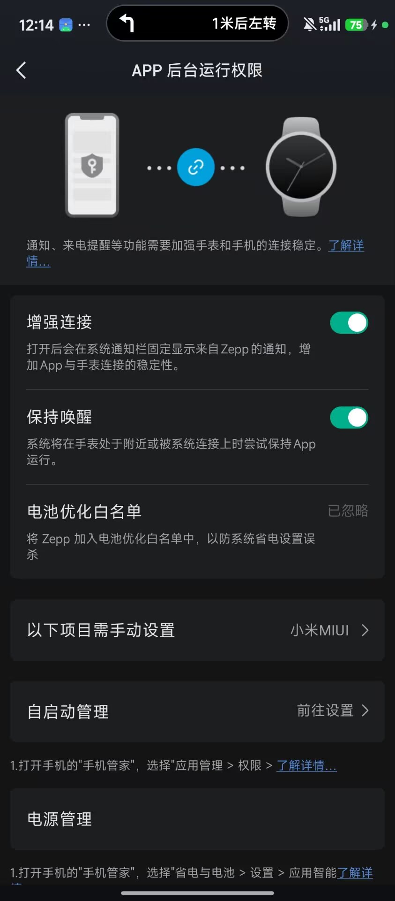

<p align="center">
  
</p>

<h1 align="center">环间导航</h1>

<p align="center"><a href="./README_EN.md">English</a></p>

<p align="center">一款运行在 Amazfit Zepp OS 圆形屏手表上的骑行导航同步应用，将高德地图与百度地图的系统导航通知实时显示到手表。</p>

<p align="center">
  <a href="#功能概览">功能</a> ·
  <a href="#界面预览">界面预览</a> ·
  <a href="#使用说明">使用</a> ·
  <a href="#开发与构建">开发</a> ·
  <a href="./LICENSE">MIT License</a>
</p>

> [!NOTE]
> 当前预览版：Android `Alpha-2`（version code `13`）· ZeppOS `v1.1.1`（version code `18`）· App ID：`1121554` · 适用于 Zepp OS 3.0 及以上运行环境。

## 功能概览

### Android 导航同步

- 仅读取高德地图与百度地图的 Android 系统导航通知，不接入地图 SDK、路线规划、定位或地图 Web API。
- 将当前下一步动作、距离、道路与来源通过手机本机桥接同步到手表。
- Android 是唯一导航会话权威；手表和 App-Side 仅保留最新有效快照，拒绝旧序号、过期方向和延迟结束事件。
- 支持直行、左右转、轻微/急转、掉头、靠边、环岛、合流、分叉、出口、到达、重新规划和等待等状态。

### 实时导航与手表显示

- 导航页使用 152px 原色动作图、超大距离、道路和来源状态，等待状态只显示文字，不保留旧方向。
- 提供夜骑道路、纯黑、导航娘三种主题；“导航娘”配置兼容既有 `anime` 存储键。
- 支持自动进入导航、骑行大字、持续亮屏、显示来源，以及关闭、转向和临近距离三档震动提醒。
- 手表息屏唤醒后会恢复本地有效缓存、完成连接握手并请求最新权威状态，不回放过期队列。

### 连接保护与诊断

- Android 配套端显示通知授权、真实监听连接、后台同步桥、Zepp App-Side 连接和手表控件确认状态。
- “增强连接”会显示真实电池不限制状态，并通过官方系统流程请求用户允许；同时提供自启动、后台运行和不从最近任务清理应用的系统指引。
- 如果系统强制停止应用，进程、前台服务和通知监听都会终止；普通应用无法自行复活，重新打开 RingMap 后即可恢复。
- Android、App-Side 和手表确认消息带有相关时间戳，便于定位通知解析、桥接、连接或页面绘制的延迟边界。

### 首次连接与激活

- 手表端首次使用需要先安装 Android 配套端，并通过 Zepp 与手机建立连接后自动激活。
- 未激活时，首页提供 Android 配套端下载二维码；“关于”页面可随时重新查看下载入口。
- Android 配套端下载：<https://yun.139.com/shareweb/#/w/i/2wFGpV8ee03ge>

## 界面预览

<table>
  <tr>
    <td width="50%" align="center">
      <br>
      <sub><b>同步状态</b><br>权限、通知监听、后台服务与手表确认状态</sub>
    </td>
    <td width="50%" align="center">
      <br>
      <sub><b>实时导航</b><br>系统通知镜像与 Android 到手表的同步状态</sub>
    </td>
  </tr>
  <tr>
    <td width="50%" align="center">
      <br>
      <sub><b>手表转向</b><br>动作、距离、道路与实时来源状态</sub>
    </td>
    <td width="50%" align="center">
      <br>
      <sub><b>等待导航</b><br>连接正常时的文字等待状态与夜骑道路主题</sub>
    </td>
  </tr>
</table>

## 支持设备

`app.json` 当前声明支持以下圆形屏 Amazfit 设备：

| 系列 | 分辨率目标 | 输入方式 |
| --- | ---: | --- |
| Amazfit Balance | 480 × 480 | 触控 |
| Amazfit Cheetah Pro | 480 × 480 | 触控 |
| Amazfit T-Rex 3 | 480 × 480 | 触控 |
| Amazfit T-Rex 3 Pro | 480 × 480 | 触控 |
| Amazfit Active 2（圆形版） | 466 × 466 | 触控 |
| Amazfit GTR 4 / GTR 4 LE | 466 × 466 | 触控 |

> [!NOTE]
> 仅包含 `app.json` 当前声明的圆形屏目标。设备系统版本、地区、Zepp App 版本和开发者中心可选设备会影响实际上架与安装范围。

## 使用说明

### 首次安装和激活

1. 使用手表端“连接手机后激活”页面的二维码，或打开 [Android 配套端下载链接](https://yun.139.com/shareweb/#/w/i/2wFGpV8ee03ge)。
2. 安装 Android RingMap，打开一次应用。
3. 在 Android 系统设置授予 RingMap“通知使用权”。状态页显示“监听已连接”才代表系统已建立真实监听。
4. 在 Zepp 中安装手表端 RingMap，并保持手机 Zepp App 与手表连接。
5. Android 导航桥连接到手表端后，手表会自动激活；可从手表首页进入导航或设置。

### Android 后台保活

1. 打开 Android RingMap 的“设置”。
2. 点击“增强连接”，根据系统确认“允许电池不限制”。
3. 点击“后台运行教程”，在系统应用详情中允许自启动和后台运行；不同品牌名称可能不同。
4. 导航期间不要从最近任务中清理 RingMap。部分系统会将此操作视为强制停止，应用无法自行恢复。



> [!WARNING]
> “通知使用权已授权”不等于“系统通知监听已连接”。如果状态页持续显示正在连接，请在 Android 系统设置中关闭再开启 RingMap 的通知使用权，然后回到 RingMap 刷新状态。

### 开始导航

1. 在高德地图或百度地图中开始导航。
2. 保持地图应用的导航通知可见；RingMap 从系统通知读取当前步骤。
3. 手表会自动进入导航页，或从首页点击“导航”查看当前有效步骤。
4. 长时间息屏后唤醒手表，RingMap 会自动请求最新状态；以手机地图界面和道路实际情况为准。

> [!WARNING]
> RingMap 不是地图、定位、路线规划或道路安全服务。请始终以手机地图应用和真实道路状况为准，骑行时注意安全。

### 隐私与数据

- 不创建账号，不申请定位、通讯录、相机、麦克风、相册或健康数据权限。
- Android 在用户授予“通知使用权”后，瞬时读取导航通知内容以提取当前动作、距离、道路与来源；通知正文不会写入 RingMap 诊断事件或上传到开发者服务器。
- 当前导航步骤只在本机 Android、Zepp App-Side 和已连接手表间同步，不上传导航正文、路线、位置或诊断事件。
- 完整隐私说明见 [PRIVACY.md](./PRIVACY.md)。

## 开发与构建

### 前置条件

- Node.js（建议使用当前维护中的 LTS 版本）
- Zepp OS 开发环境与 Zeus CLI
- JDK 17 或更高版本
- Android SDK（本项目使用 compileSdk 35）

### 安装依赖

```bash
npm install
```

### 构建安装包

```bash
npm run release:watch
```

构建产物会生成在 `dist/` 目录。发布脚本会为支持设备构建安装包，并生成版本与 SHA-256 清单。

Android 配套端位于仓库的 `android/` 目录，可使用 Android Studio 或 Gradle 构建：

```bat
cd android
gradlew.bat clean testDebugUnitTest assembleDebug
```

### 启动 Zeus 预览

```bash
npm run preview
```

## 项目结构

```text
app.js                 # 手表端全局状态、连接握手、TTL、路由和确认消息
app-side/index.js      # Android WebSocket 与手表消息中继
page/                  # 手表主页、激活、导航、主题、设置、关于
shared/                # 消息、协议和震动纯逻辑
assets/<target>/       # 各设备原生资源及下载二维码
android/               # 可直接构建的 Android 配套端源码
scripts/               # Android 同步、多目标构建和市场素材辅助脚本
tests/                 # Node 协议、资源、产品和镜像契约测试
docs/                  # 协议、设计、截图和市场提交材料
```

## 验证

```bash
npm test
npm run build
```

发版前还应执行 Android 单元测试、Debug 构建、ZeppOS 多目标构建、Android 源码镜像一致性和发布清单检查。详细协议说明见 [docs/PROTOCOL_V2.md](./docs/PROTOCOL_V2.md)。

## 开源协议

本项目采用 [MIT License](./LICENSE) 开源。你可以在保留版权与许可声明的前提下使用、修改、分发或商用本项目。
