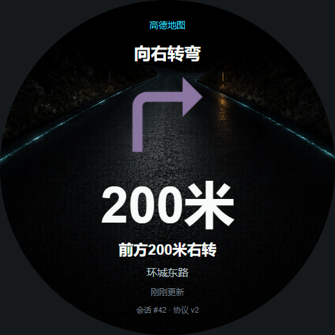
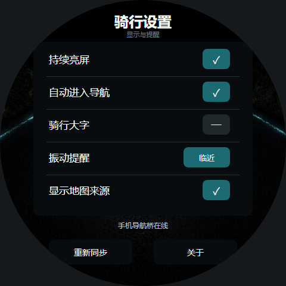
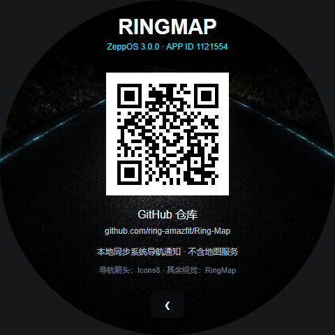

# RingMap · 环间导航

RingMap 将手机系统中的高德/百度导航通知实时同步到 ZeppOS 手表。它只展示当前下一步，不自行定位、规划路线或请求地图 API。

- Android：`3.0.1`，包名 `com.ringmap.nav`
- ZeppOS：`3.0.1`，App ID `1121554`
- 同步协议：`v2`
- 仓库：<https://github.com/ring-amazfit/Ring-Map>

## 视觉预览

以下为基于实际 480px 资源和页面坐标生成的圆屏设计预览；最终字体栅格与裁切以具体手表为准。

| 实时导航 | 骑行设置 | 关于与 GitHub |
| --- | --- | --- |
|  |  |  |

## 数据链路

```text
高德 / 百度系统导航通知
  -> Android NotificationListenerService
  -> NavParser + NavSessionController
  -> 本机 WebSocket 127.0.0.1:8886
  -> Zepp App-Side
  -> MessageBuilder / BLE
  -> ZeppOS 全局状态 reducer
  -> 手表页面
```

Android 是导航会话的唯一权威。每个权威状态携带单调 `stateRevision`，快照另含 `sessionId + seq + ttlMs`；App-Side 和手表只保存最新状态，并保留结束会话 tombstone，拒绝旧序号、延迟 idle、旧会话复活和过期方向。连接恢复后直接请求权威快照，不回放旧步骤队列。

协议细节见 [docs/PROTOCOL_V2.md](docs/PROTOCOL_V2.md)。圆屏布局和视觉约束见 [docs/DESIGN.md](docs/DESIGN.md)。

## 主要能力

- 高德地图与百度地图系统导航通知解析
- 26 类导航动作：直行、普通/轻微/急转、前后方、左右掉头、靠左/靠右、环岛、合流、分叉、出口、到达、重新规划和等待
- 语义去重、单调序号、来源锁定、通知替换宽限和 45 秒旧数据失效
- 每个 App-Side 上下文保持单 WebSocket；Android 允许 Zepp 的多个合法 companion 上下文并存，避免相互驱逐重连
- 手表 accepted/applied ACK 与 Android -> App-Side -> Watch 分段时序诊断
- 自动进入导航、骑行大字、持续亮屏、显示来源，以及唤醒后的自动重连与快照恢复
- 夜骑道路、纯黑、导航娘三套手表主题；等待连接/确认时只显示文字
- 152px 手表动作图与 152dp Android 动作槽位
- 三态震动：关闭、仅新转向、转向 + 500/200/80 米临近提醒
- Android Material 3 / Monet 多页面界面：状态、实时导航、诊断、设置、关于
- 手表关于页 GitHub 二维码；Android 关于页直接打开仓库

## 支持设备

| Target | 设计宽度 |
| --- | ---: |
| Amazfit Balance | 480 |
| Amazfit Cheetah Pro | 480 |
| Amazfit Active 2 | 466 |
| Amazfit GTR 4 | 466 |
| Amazfit T-Rex 3 | 480 |
| Amazfit T-Rex 3 Pro | 480 |

资源按 target 原生输出；背景、动作图和二维码均进入对应 `assets/<target>`，不依赖运行时缩放源文件。

## 使用

1. 安装 Android 配套 App。
2. 在系统设置授予 RingMap「通知使用权」。
3. 允许应用自启动、后台运行和电池不限制。
4. 通过 Zepp 安装手表端 RingMap，并保持 Zepp 与手表连接。
5. 在高德或百度开始导航；当前步骤会自动同步。

Android 的“已授权”只代表权限记录。状态页中的“系统通知监听已连接”才表示 Android 已建立真实 `NotificationListenerService` 绑定。

## 隐私边界

RingMap：

- 不申请定位权限
- 不接入高德/百度地图 SDK
- 不调用地图、搜索、路线或导航 Web API
- 不保存 API Key
- 不上传导航正文或诊断日志
- 诊断事件仅驻留在当前 Android 进程，默认不记录路名

`INTERNET` 权限仅用于手机本机 `127.0.0.1:8886` WebSocket 通信。

## 构建与测试

### ZeppOS

```bash
cd D:/ring/RingMap
npm test
npm run release:watch
```

`release:watch` 会对 Balance、GTR 4、GTR 4 Limited Edition、Cheetah Pro、Active 2、Active 2 NFC、T-Rex 3 和 T-Rex 3 Pro 逐一执行 `zeus build --target` 与必须的 `zeus prune --ip`。八个设备类型包复用六套资源 target，按设备命名的 `.zab` 位于 `dist/`，构建产物被 Git 忽略。

### Android

仓库内 Android 镜像位于 `android/`：

```bat
cd /d D:\ring\RingMap\android
set JAVA_HOME=D:\moondrop\tools\jdk-21.0.11+10
set ANDROID_HOME=D:\moondrop\tools\android-sdk
set ANDROID_SDK_ROOT=D:\moondrop\tools\android-sdk
gradlew.bat testDebugUnitTest assembleRelease
```

Android 工程使用 Java 17、minSdk 24、targetSdk 35、Material 3 和 Java-WebSocket。

## 目录

```text
app.js                 ZeppOS 全局协议 reducer、TTL、路由和 ACK
app-side/index.js      Android WebSocket 与 MessageBuilder 自恢复中继
page/                  手表主页、导航、主题、设置、关于
shared/                消息、协议和振动纯函数
assets/<target>/       各设备原生运行资源
android/               Android 配套端源码镜像
tests/                 Node 协议、资源和产品契约测试
docs/                  协议、设计和预览
```

## 第三方资源

部分导航箭头来自 Icons8，并保留其原始颜色。缺失动作与“夜骑路廊”背景为 RingMap 原创。完整说明见 [THIRD_PARTY_NOTICES.md](THIRD_PARTY_NOTICES.md)。
